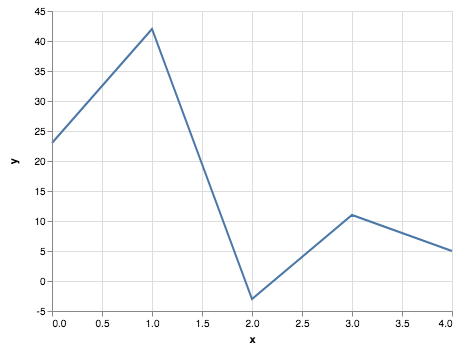

# Classi Point2D e TimeSeries

Si vuole creare un programmino in `C++` per generare, manipolare e analizzare delle serie temporali (_time series_). Una serie temporale può essere espressa come una sequenza di punti in uno spazio 2D. Per esempio, la seguente sequenza

```
(0,23), (1,42), (2,-3), (3,11), (4,5)
```

rappresenta una serie temporale di 5 osservazioni (dall'istante temporale 0 all'istante temporale 4). La sua rappresentazione visuale è la seguente:



Il programmino deve permettere di:

- creare e manipolare dei punti in 2D,
- creare e manipolare una serie temporale,
- effettuare diverse analisi su di una serie temporale.

L'implementazione è distinta in diverse parti (da fare insieme a tutoraggio oppure da soli) e non tutte le parti sono _attualmente_ disponibili. Saranno disponibili man mano durante gli incontri di tutoring.

## Parte 1: la classe Point2D.h

La classe `Punto2D` modella un punto in 2D. Nello specifico, un punto `p` è rappresentato da due coordinate `(x,y)`. Nella implementazione da effettuare, `x` è una coordinata intera, mentre `y` può essere definita come intera (`int`) o razionale (`float` o `double`).

In particolare, la classe deve prevedere le seguenti funzionalità:

- Istanziare un punto 2D (in `(0,0)` oppure con le coordinate fornite dall'utente),
- Copiare un punto 2D a partire da un altro punto 2D,
- Verificare se due punti 2D sono uguali o diversi,
- Effettuare la somma di due punti 2D (dove la somma è definita come la somma delle rispettive componenti),
- Effettuare la differenza di due punti 2D (dove la differenza è definita come la differenza delle rispettive componenti),
- Accedere a e modificare le componenti `x` e `y`,
- Una funzione definita come `friend` che permetta di stampare un punto su standard output (i.e., `cout`).

## Parte 2: la classe TimeSeries.h

La classe TS rappresenta una serie temporale (nell'accezione data poco sopra). In particolare, la classe deve contenere una serie di punti contigui e deve dare la possibilità di aggiungerne di nuovi o rimuoverli. Attenzione: la contiguità deve essere sempre mantenuta. Con contiguità si intende che, dati due punti in posizione `i` e `i+1` con coordinate `(a,b), (c,d)`, essi sono contigui sse `c = a+1`.

Esempio di serie temporale corretta (la contiguità è mantenuta):
```
(0, 3), (1, 4), (2, 2), (3, -2), (4, -6)
```

Esempio di serie temporale non corretta:
```
(0, 3), (1, 4), (3, 5), (4, -2), (5, -6)
```

La classe deve prevedere le seguenti funzionalità:

- Creazione di una serie temporale vuota,
- Creazione di una serie temporale a partire da un array di punti 2D,
- Copiare una serie temporale a partire da un'altra serie temporale,
- Verificare se la contiguità di una serie temporale è mantenuta o meno,
- Verificare se due serie temporali sono uguali o differenti (due serie temporali sono uguali se contengono gli stessi punti 2D nello stesso ordine),
- Aggiungere un punto 2D in coda ad una serie temporale,
- Rimuovere un punto 2D in coda ad una serie temporale,
- Rimuovere un punto 2D in testa alla serie temporale (e traslare tutte le coordinate `x` dei punti 2D seguenti di -1).